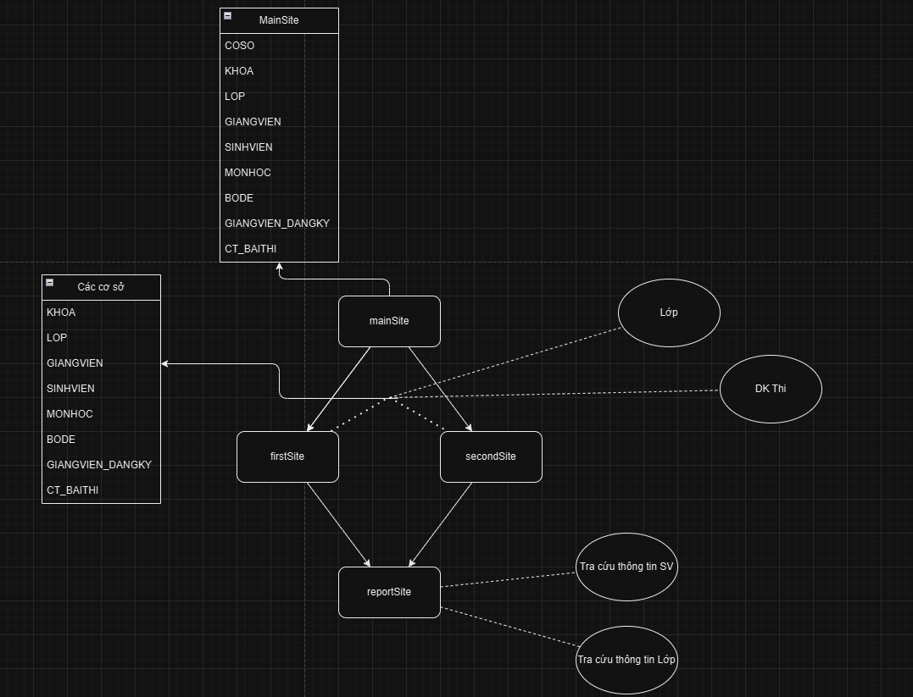
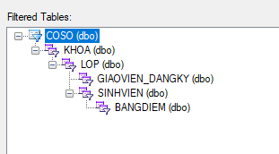
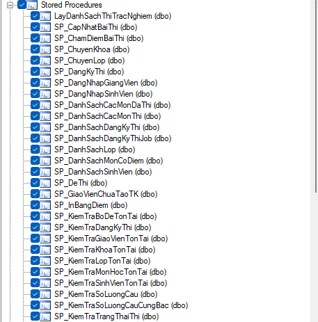
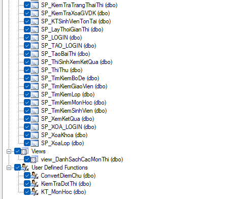
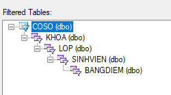

# Đồ án môn cơ sở dữ liệu phân tán nhóm 7 lớp D21CQCN02-N
## Đề tài: 
- Quản lý thi trắc nghiệm

## Giảng viên hướng dẫn
- Lưu Nguyễn Kỳ Thư

## Thông tin kĩ thuật: 
 - JDK1.8(cho server tomcat)
 - Java phiên bản >= 9(cho rsp/Community Server Connectors)
 - Server tomcat
 - MSSQL server với database có sẵn "TN_CSDLPT" (không sử dụng hibernate, xem thiết lập ở [src/main/webapp/WEB-INF/configs/jdbc.xml](https://github.com/Phuongp2003/ThiTracNghiem_CSDLPT/blob/main/src/main/webapp/WEB-INF/configs/jdbc.xml))
 - Tham khảo cơ sở dữ liệu trong repo

## Cấu trúc phân tán
- Xem sơ đồ dưới

 
### Chi tiết
#### Mảnh cơ sở 1 và 2
- Cấu trúc:

 
- Danh sách SP sử dụng:

  
  
 #### Mảnh tra cứu (không có SP)
 Cấu trúc:
 
 
  
## Phân công báo cáo
**1 . PHẠM BÙI NAM PHƯƠNG**
- Form sinh viên: Thêm, xóa, sửa, phục hồi, reload.
   - SP_KiemTraSinhVienTonTai
   - SP_TimKiemSinhVien
- Form giáo viên: Thêm, xóa sửa, phục hồi, reload
	- SP_KiemTraGiaoVienTonTai
	- SP_TimKiemGiaoVien
- Form thi: thi thử và in kết quả
	- SP_ThiThu: đối với GIANGVIEN
	- SP_DanhSachCacMonDaThi
	- SP_ThiSinhXemKetQua: in ra điểm của sinh viên sau khi thi
	- SP_XemKetQua: in ra chi tiết bài thi
- Báo cáo xem kết quả: cho phép sinh viên in ra các câu đã thi
	- SP_XemKetQua: in ra chi tiết bài thi
- Các chức năng hỗ trợ: undo, redo, reload.
**2 . NGUYỄN PHI LONG:**
- Form đăng nhập:
	- SP_TAO_LOGIN
	- SP_DangNhapGiangVien
	- SP_DangNhapSinhVien
	- SP_GiaoVienChuaTaoDangKy
- 	Form khoa, lớp: Thêm, xóa, sửa, reload, undo
	- SP_KiemTraKhoaTonTai
	- SP_KiemTraLopTonTai
	- SP_TimKiemLop
- Form chuẩn bị thi:
	- SP_KiemTraSoLuongCau
	- SP_KiemTraDangKyThi
	- SP_DangKyThi
	- SP_KiemTraXoaGVDK
- Form thi: lưu kết quả
	- SP_CapNhatBaiThi: lưu đáp án sinh viên
	- SP_KiemTraTrangThaiThi
	- SP_LayThoiGianThi
- Báo cáo: Danh sách đăng ký thi trắc nghiệm ở 2 cơ sở theo khoảng thời gian.
	- Function KiemTraDotThi: Kiểm tra xem đợt thi này đã thi chưa.
	- SP_DanhSachDangKyThi
	- SP_DanhSachDangKyThiJob

**3. NGUYỄN PHÚC MINH KHANG**
- Form môn học: Thêm, xóa, sửa, reload, undo
	- SP_KiemTraMonHocTonTai
	- SP_TimKiemMonHoc
- Form nhập đề: Thêm, xóa, sửa, reload, undo
	- SP_KiemTraBoDeTonTai
	- SP_TimKiemBoDe
- Form thi: tạo bài thi
	- SP_DanhSachCacMonThi
	- SP_TaoBaiThi
	- SP_DeThi
	- SP_ChamDiemBaiThi
- Báo cáo Bảng điểm môn học: in ra bảng điểm thi hết môn của một lớp.
	- SP_InBangDiem
	- Function ConvertDiemChu

## Thành viên

<table>
    <tr>
        <th>Tên</th>
        <th>Link Github</th>
        <th>Vai trò</th>
    </tr>
    <tr>
        <td>Nguyễn Phúc Minh Khang</td>
        <td><a href="https://github.com/NguyenPhucMinhKhang">NguyenPhucMinhKhang</a></td>
        <td>
	    - Tạo các SP (nổi bật là tạo bài thi, chấm bài thi)   
	    - Phân bổ công việc  
    </td>
    </tr>
    <tr>
        <td>Nguyễn Phi Long</td>
        <td><a href="https://github.com/NguyenPhiLongIT">NguyenPhiLongIT</a></td>
        <td>
    - Xây dựng giao diện cho trang sinh viên, giáo viên, môn học, lớp/khoa 
    - Xây dựng các tính năng thêm/xoá/sửa các thành phần  
    - Tạo tài khoản cùng vai trò/dưới vai trò/...  
    - Áp dụng các tính năng khác vào các trang
	    </td>
    </tr>
    <tr>
        <td>Phạm Bùi Nam Phương</td>
        <td><a href="https://github.com/Phuongp2003">Phuongp2003</a></td>
        <td>
     - Khởi tạo và quản lý dự án   
    - Làm phần đăng nhập, phân quyền, quản lý truy cập cơ sở dữ liệu  
    - Cấu trúc cho tính năng undo/redo  
    - Làm giao diện và xử lý phần bài thi, bao gồm các SP liên quan  
    - Tối ưu hoá giao diện các trang 
        </td>
    </tr>
</table>

- Quá trình: có thể xem file ROADMAP.MD
- Điểm số: tất cả đều qua môn :v
## Cài đặt và sửa lỗi
- Xem và tham khảo [project Lập trình web](https://github.com/Phuongp2003/LTWeb_PTITHCM/blob/main/README.md)
