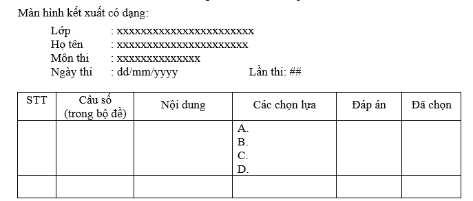
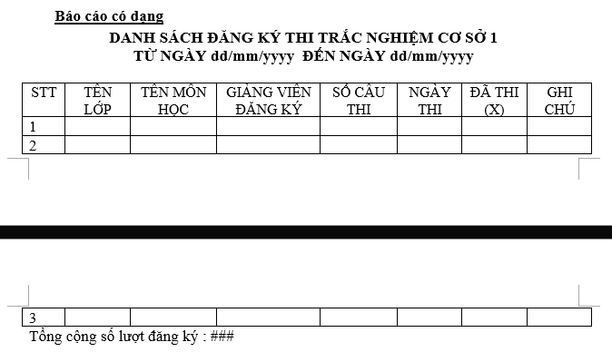

    Fix SP support throw error

TẤT CẢ CÁC SP, FUNCTION
| Is Fixed | Done? | Name (+Last time update?)                    |Link Message
|----------|-------|--------------------------|-------------------
| [ ]      | [X]   | SP_CapNhatBaiThi         
| [ ]      | [X]   | SP_ChamDiemBaiThi           
| [ ]      | [X]   | SP_DangKyThi
| [ ]      | [X]   | SP_DangNhapGiangVien
| [ ]      | [X]   | SP_DangNhapSinhVien
| [ ]      | [X]   | SP_DanhSachCacMonThi
| [ ]      | [X]   | SP_DanhSachDangKyThi
| [ ]      | [X]   | SP_DanhSachDangKyThiJob
| [ ]      | [X]   | SP_DanhSachMonCoDiem
| [ ]      | [X]   | SP_DeThi
| [ ]      | [X]   | SP_InBangDiem
| [ ]      | [X]   | SP_KiemTraBoDeTonTai
| [ ]      | [X]   | SP_KiemTraDangKyThi
| [ ]      | [X]   | SP_KiemTraGiaoVienTonTai
| [ ]      | [X]   | SP_KiemTraKhoaTonTai
| [ ]      | [X]   | SP_KiemTraLopTonTai
| [ ]      | [X]   | SP_KiemTraMonHocTonTai
| [ ]      | [X]   | SP_KiemTraSinhVienTonTai
| [ ]      | [X]   | SP_KiemTraSoLuongCau
| [ ]      | [X]   | SP_KiemTraTrangThaiThi
| [ ]      | [X]   | SP_KiemTraXoaGVDK
| [ ]      | [X]   | SP_LayThoiGianThi
| [ ]      | [X]   | SP_TaoLogin
| [ ]      | [X]   | SP_TaoBaiThi
| [ ]      | [X]   | SP_ThiSinhXemKetQua
| [ ]      | [X]   | SP_ThiThu
| [ ]      | [X]   | SP_TimKiemBoDe
| [ ]      | [X]   | SP_TimKiemGiaoVien
| [ ]      | [X]   | SP_TimKiemLop
| [ ]      | [X]   | SP_TimKiemMonHoc
| [ ]      | [X]   | SP_TimKiemSinhVien
| [ ]      | [X]   | SP_XemKetQua
| [ ]      | [X]   | SP_XOA_LOGIN
| [ ]      | [X]   | SP_XoaKhoa
| [ ]      | [X]   | SP_XoaLop
| [ ]      | [X]   | FUNCTION ConvertDiemChu
| [ ]      | [X]   | FUNCTION KiemTraDotThi

    Tasks

- [x] Khởi tạo dự án
- [x] Kết nối database, thử kết nối và lấy data
- [x] Tạo phần đăng nhập
- [x] Import bean
- [x] Thêm form mức đổ dữ liệu giáo viên, sinh viên, môn học, khoa-lớp 
    (sinh viên, môn học hoàn thiện nhất có lọc theo lớp, khoa)
- [x] Chỉnh các connection thành global
- [ ] Login: chỉnh role thành check box
- [x] Login: chỉnh danh sách phân mảnh lấy bằng cách dùng SP
- [X] Form môn học: 
  - [X] thêm
  - [X] xóa
  - [X] sửa
  - [X] phục hồi
  - [X] reload?
- [X] Form khoa, lớp
  - [X] Show song song 2 form
  - [X] Khoa
    - [X] Thêm
    - [X] Xóa
    - [X] Sửa
    - [X] Phục hồi
    - [X] Reload?
  - [X] Lớp
    - [X] Thêm
    - [X] Xóa
    - [X] Sửa
    - [X] Phục hồi
    - [X] Reload?
- [X] Form sinh viên (của lớp)
  - [X] Thêm
  - [X] Xóa
  - [X] Sửa
  - [X] Phục hồi
  - [X] reload
- [x] Form (subform) giảng viên (của khoa)
  - [x] Thêm
  - [x] Xóa
  - [x] Sửa
  - [x] Phục hồi
  - [x] reload
- [X] Nhập đề (Giảng viên only), giảng viên chỉ thấy và sửa câu hỏi của mình (bảng BoDe)
  - [x] Thêm
  - [X] Xóa
  - [X] Sửa
  - [X] Phục hồi
  - [X] reload
- [X] Chuẩn bị thi
  - [X] Nhân viên nhập tên lớp, môn sẽ thi, trình độ, lần thi, số câu thi, ngày thì, thời gian thi(phút), ghi vào GiangVien_DangKy
  - [ ] Khi đăng ký thi cần kiểm tra ràng buộc
- [X] Thi
  - [x] Phần thông tin thí sinh: Mã lớp, tên lớp, họ tên
  - [x] Phần bài thi: 
    - [x] Môn thi, ngày thi, số lần thi
    - [x] Lọc ra số câu thi, thời gian thi, trình độ(giáo viên đăng ký)
    - [x] Khi nhấn "bắt đầu thi", lọc các câu từ bước 2 phía trên (ngẫu nhiên, không trùng), sau đó tiến hành cho thí sinh thi ***(giao tác)***
  - [x] Tiêu chí đề thi:
    - [x] Ngẫu nhiên, không trùng nhau
    - [x] Lấy theo trình độ A, B hay C
    - [x] Ưu tiên lấy các câu trình độ cao, nếu thiếu thì lấy ở trình độ thấp hơn
    - [x] Số câu trình độ cao **bắt buộc lớn hơn 70%**, nếu thiếu có thể lấy ở cơ sở khác
    - [x] Ưu tiên lấy ở cơ sở mà lớp đố học
    - [x] Điểm cao nhât là 10, số điểm mỗi câu là như nhau (trung bình cộng go brr)
    - [x] Cho user chọn câu đã thi ở lần thi trước
    - [x] Hết thời gian quy định => buộc kết thúc bài thi
    - [X] Thông báo điểm cho sinh viên và lưu vào BangDiem
- [X] Xem kết quả
  - [X] In ra số câu đã thi dựa trên các thông tin Mã sinh viên, môn học, lần thi
  - [X] Kết xuất bắt buộc
  
- [X] Bảng điểm môn học
  - [X] Giáo viên chọn tên lớp, tên môn học, lần thi: chương trình in ra bảng điểm hết môn của lớp đã chọn
  - [X] Mẫu bảng: (Stt,) MASV, HO, TEN, DIEM, ĐIỂM CHỮ
- [x] Báo cáo DANH SÁCH ĐĂNG KÝ THI TRẮC NGHIỆM CƠ SỞ X
  - [x] Xem danh sách đăng ký thi trắc nghiệm của cả 2 cơ sở @tungay đến @denngay; In theo từng cơ sở, in theo thứ tự tăng dần của ngày đăng ký ***(xử lý job)***
  - [x] Mẫu: 
  

    SP Task

- [x] Xem, thêm, xóa, sửa(, phục hồi, reload) môn học
- [x] Xem, thêm, xóa, sửa(, phục hồi, reload) khoa
- [x] Xem, thêm, xóa, sửa(, phục hồi, reload) lớp
- [x] Xem, thêm, xóa, sửa(, phục hồi, reload) sinh viên
- [x] Xem, thêm, xóa, sửa(, phục hồi, reload) giáo viên
- [x] Xem, thêm, xóa, sửa(, phục hồi, reload) đề thi (câu hỏi)
- [x] Xem, thêm, xóa, sửa(, phục hồi, reload) GiangVien_DangKy; khi thêm, sửa cần kiểm tra ràng buộc
- [x] Xem thông tin thí sinh dự thi
- [x] ***Lọc danh sách câu hỏi phù hợp với thí sinh tham gia dự thi***
- [x] ***Chọn câu hỏi từ danh sách đã lọc để tạo đề thi***
- [X] Tạo / sửa bảng tạm (local) lưu kết quả thi của sinh viên (theo 2 cách, mỗi 1 khoảng thời gian khi thi, hoặc ngay khi thí sinh chọn/đổi đáp án của 1 câu hỏi)
- [X] Lưu kết quả cuối cùng vào BangDiem
- [X] Show kết quả bài thi, output: STT, Câu số (trong đề), Nội dung, Các chọn lựa, đáp án (lựa chọn sính xác), Đã chọn (đáp án thí sinh chọn)
- [X] Bảng điểm môn học của lớp, output: (Stt,) MASV, HO, TEN, DIEM, ĐIỂM CHỮ
- [X] Báo cáo danh sách đăng ký thi

